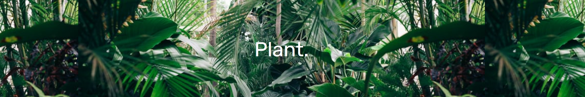

# Project 2

## Our Project: Plant.

### Overview

This repository contains code for an interactive information web app called **'Plant.'** which aims to promote environmental consciousness through knowledge of household plant care!

Houseplants, as well as outdoor plants, have become increasingly popular for decorating rooms and making outdoor lawns and garden more aesthetically pleasing but often, this tendency towards the aesthetic results in buying plants that cannot thrive in the space that you put them in as well as the expertise that the plant buyer has in caring for certain kinds of plants leads to dying plants and a waste of resources. Additionally, poor house plant consciousness and care has been shown to have a negative environmental impact. By making it easier for plant owners to know what care is best suited for a plant, we hope to make people more conscious of their environmental impact as well as promote overall better plant care.

### Audience

Users of our proposed application include anyone interested in the cultivation of houseplants, specifically, users who need help identifying which plant species best suits their needs. Our website aims to inform users of the qualities and care needed to maintain specific houseplants with an emphasis on environmental consciousness. Thus, this topic naturally lends itself to a user demographic that is likely inexperienced with houseplants and interested in the environmental impacts houseplants have.

The site can be viewed at <https://plant-abb5d.firebaseapp.com>
